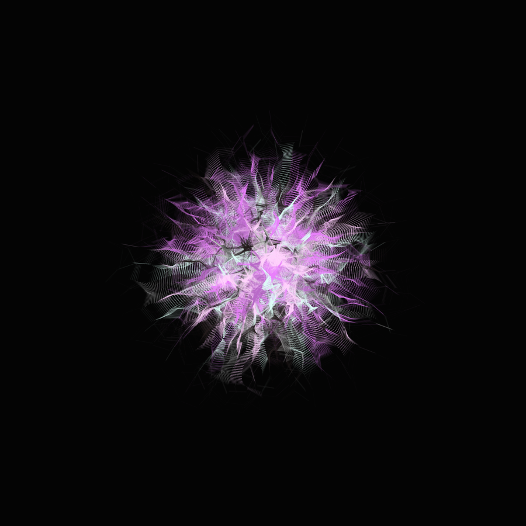
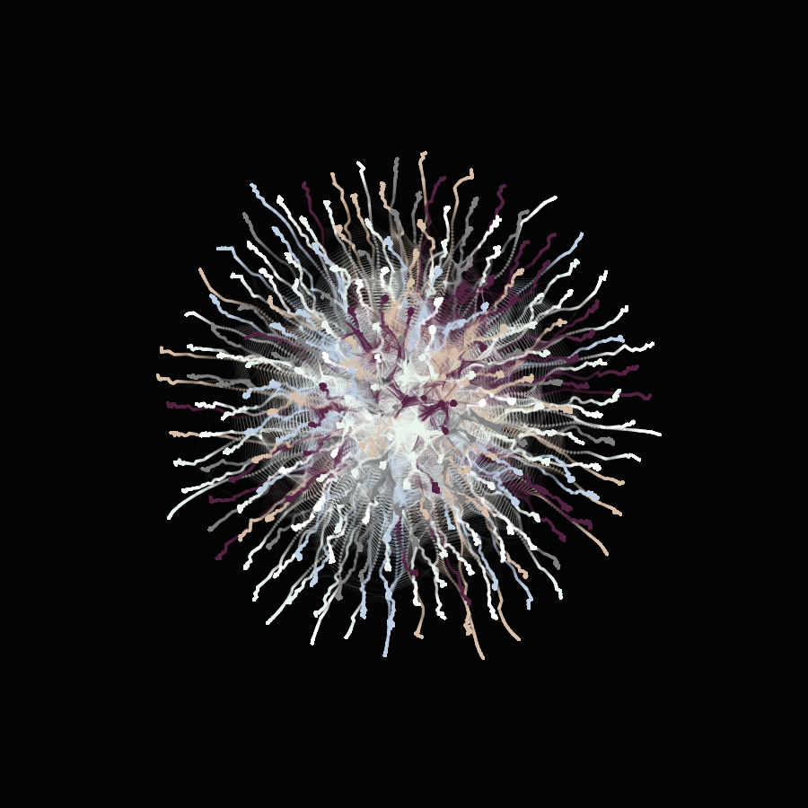
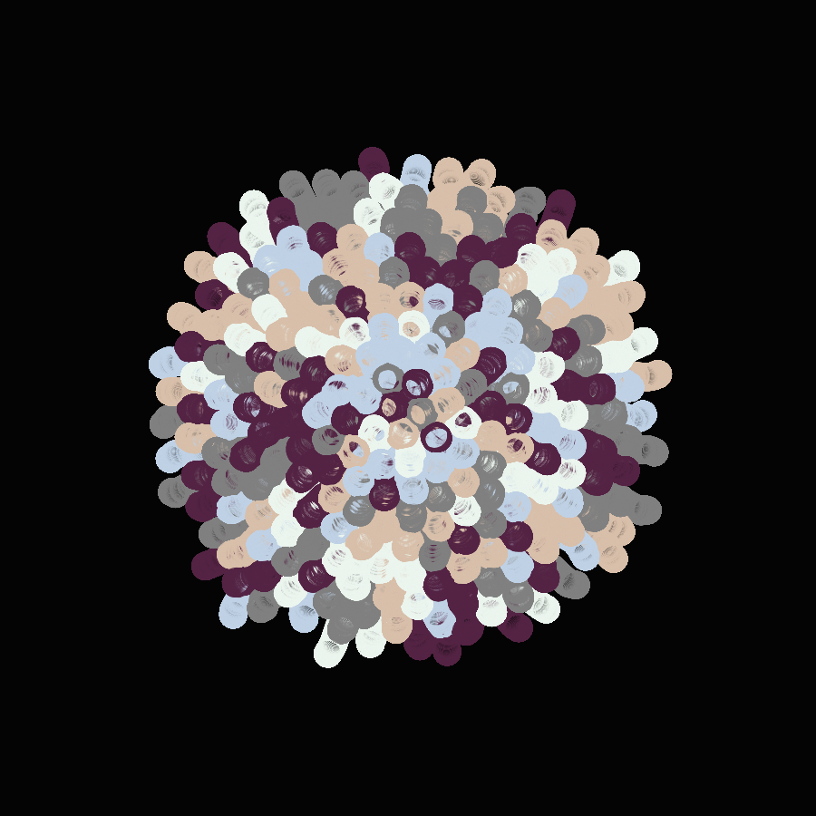
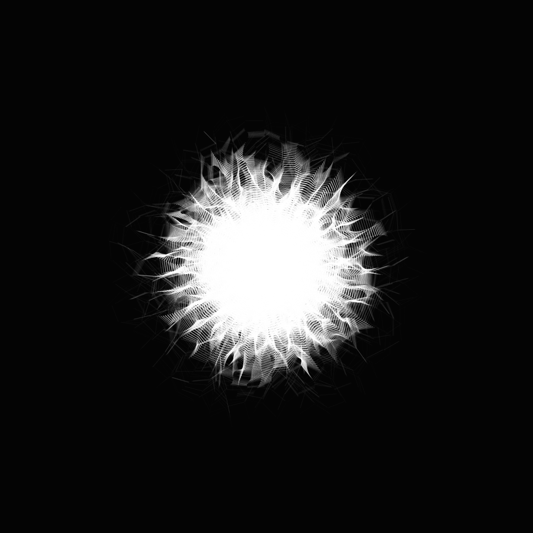
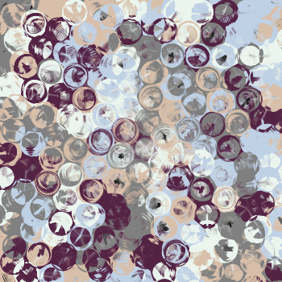
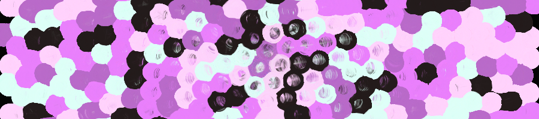
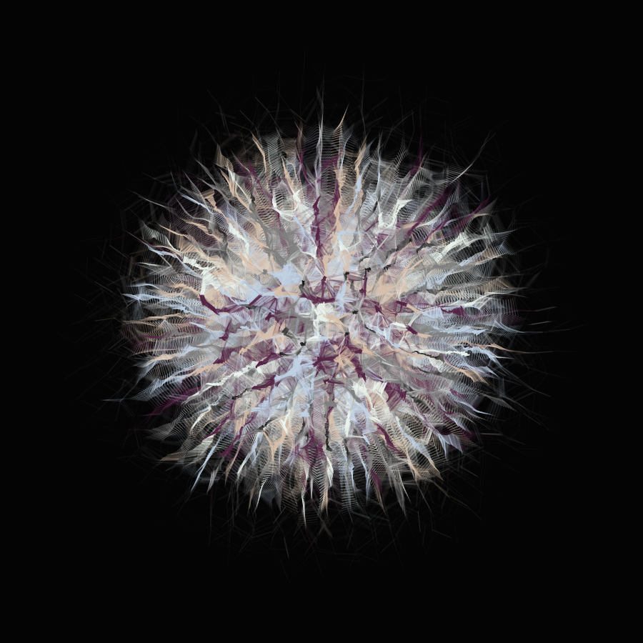
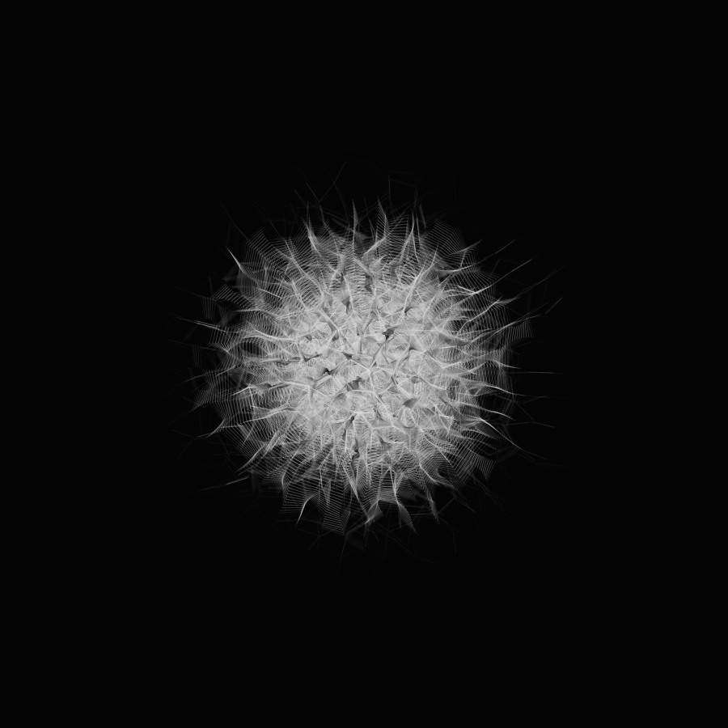
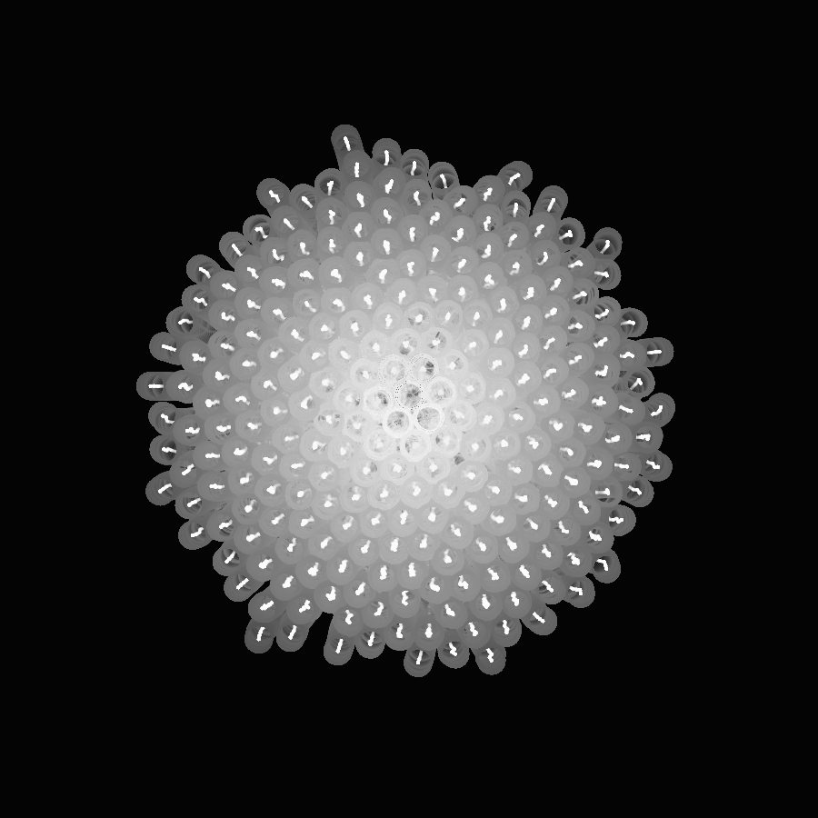

# Reaction-1
Creating shapes out of reactions between circles.

## Description
Will generate an image with random colors from a choosen palette.

## Usage
Use the panel to change the generation.

Use Generate to generate a new image.

Use Save or press P to save your image.

## Exemples

